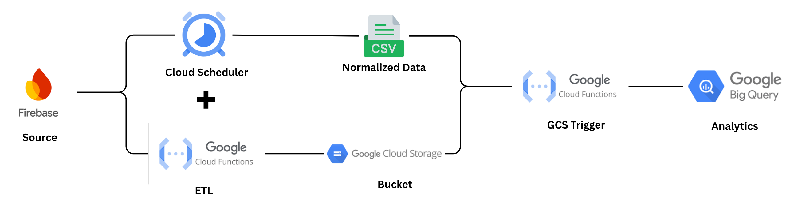
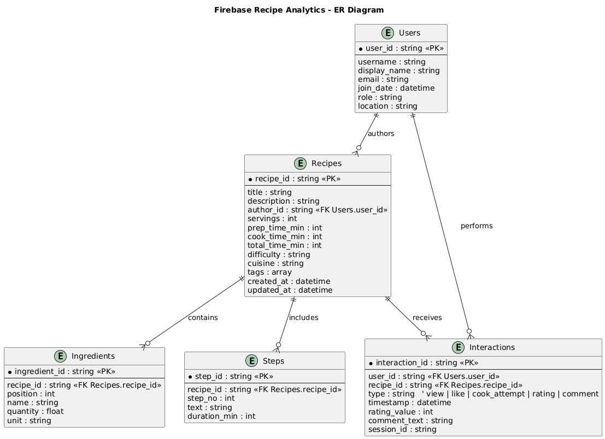
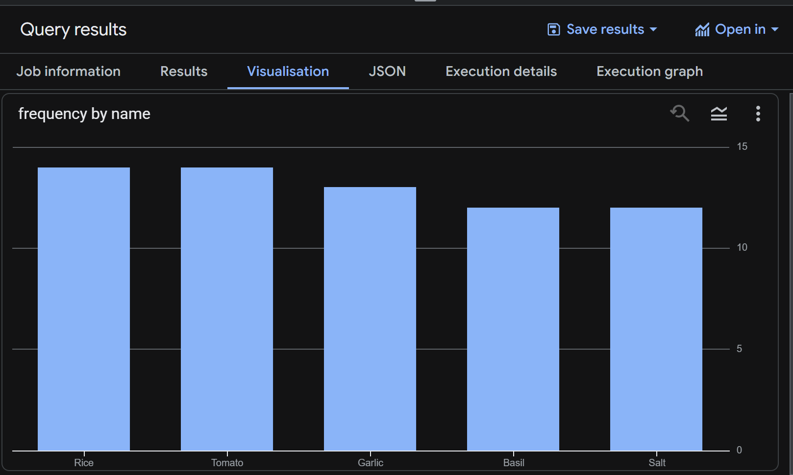
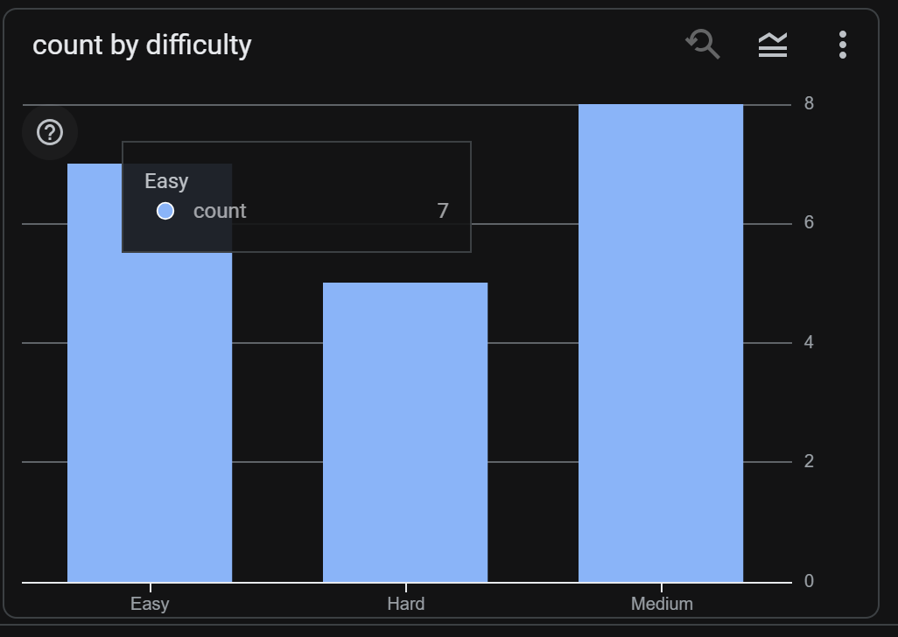
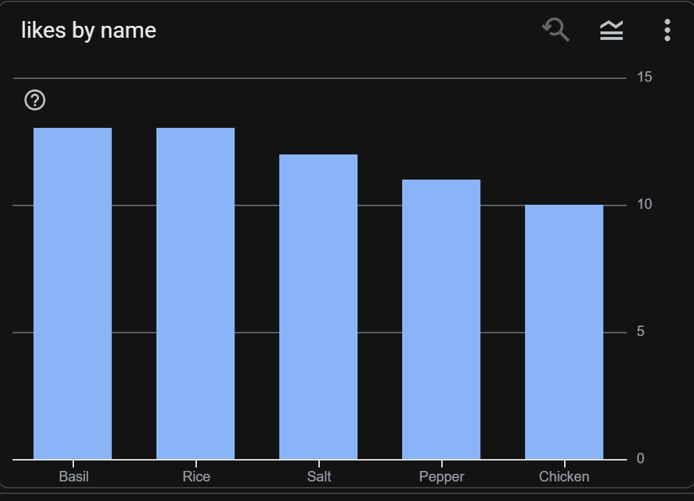
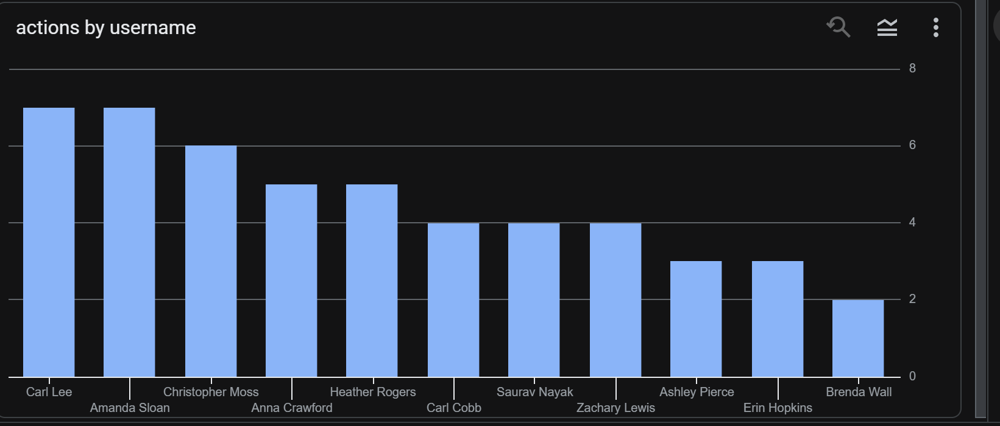

Recipe Analytics Data Pipeline
==============================

**Author:** Saurav Nayak <br>
**Role:** Data Engineer <br>
**E-mail:** nayaksaurav99@gmail.com <br>
**Project:** Firebase-Based Recipe Analytics Pipeline
---
--------------------
1\. Project Overview
--------------------
This project implements an end-to-end Data Engineering pipeline designed to ingest, transform, and analyze recipe data. The system leverages **Firebase Firestore** as a flexible, transactional NoSQL source and **Google BigQuery** as a high-performance analytical data warehouse.

The core objective is to create a robust system capable of analyzing user engagement metrics (views, likes) and recipe complexity factors (ingredients, steps) to derive actionable business insights. By bridging the gap between operational application data and analytical reporting, this pipeline enables data-driven decision-making for content strategy and platform optimization.

**Key Features:**

-   **Source:** Firebase Firestore (Document-Oriented NoSQL).

-   **Extraction & Transformation:** A serverless Python ETL pipeline that normalizes semi-structured JSON data into a relational schema.

-   **Storage:** Google Cloud Storage serves as a Data Lake for raw backups, while BigQuery acts as the Data Warehouse for structured analytics.

-   **Automation:** The pipeline is event-driven, automatically updating analytical tables whenever new data is uploaded.

__ETL Flow:__


---
2\. Data Model & Schema
-----------------------

The project uses a hybrid data model to handle both semi-structured source data and structured analytical data.

### A. NoSQL Source Schema (Firestore)

The source data is stored in 3 collections in the default database:

-   **`users`**: Stores user profiles.

-   **`recipes`**: Stores recipe details. Uses **nested arrays** for `ingredients` and `steps`.

-   **`interactions`**: A transactional log linking Users to Recipes (Views, Likes, Cook Attempts).

### B. Normalized Relational Schema (BigQuery)

To facilitate SQL analysis, the data is normalized into 5 tables (Star Schema approach):

1.  **`users`**: Dimension table (`user_id`, `username`, `email`).

2.  **`recipes`**: Fact/Dimension table (`recipe_id`, `prep_time`, `difficulty`).

3.  **`ingredients`**: Bridge table exploding the ingredients array (One-to-Many).

4.  **`steps`**: Bridge table exploding the steps array (One-to-Many).

5.  **`interactions`**: Fact table for user events (`view`, `like`, `timestamp`).

ER Diagram:

---
3\. Setup & Prerequisites
-------------------------
To successfully deploy and run this pipeline, the following prerequisites must be met.

**System Requirements:**

-   **Python:** Version 3.8 or higher.

-   **Google Cloud Platform (GCP):** An active GCP project ID with billing enabled.

    -   **APIs Enabled:** Cloud Functions API, Cloud Build API, BigQuery API, Cloud Storage API, Artifact Registry API.

-   **Firebase:** A Firebase project linked to the GCP project with Firestore enabled.

-   **Service Account:** A service account JSON key (`serviceaccount.json`) with permissions for Firestore Admin, Storage Admin, and BigQuery Admin (required for local execution).

**Dependencies:** The project relies on several Python libraries. Install them using the provided `requirements.txt` file:

Bash

```
pip install firebase-admin faker google-cloud-bigquery google-cloud-storage pandas fun
```

---
4\. Implementation Guide (How to Run)
-------------------------------------
This section details how to execute the full data pipeline, from local setup to cloud deployment.

#### **Step 0: Local Environment Setup**

It is recommended to use a virtual environment to manage dependencies.

Bash

```
# 1. Create a virtual environment
python -m venv .venv

# 2. Activate the environment
# Windows:
.venv\Scripts\activate
# Mac/Linux:
source .venv/bin/activate

# 3. Install dependencies
pip install -r requirements.txt

```

#### **Step 1: Seed the Firestore Database**

This script populates your Firestore database with the initial "Chicken Gravy" recipe and generates synthetic data for testing.

Bash

```
python src/insert_recipe.py

```

-   **Action:** Connects to Firestore, creates collections (`users`, `recipes`, `interactions`), and inserts documents.

-   **Verification:** Check your Firestore Console to confirm data creation.

#### **Step 2: Trigger the Cloud ETL Pipeline**

The core ETL process is hosted as a Google Cloud Function. You can trigger it manually via its HTTP endpoint or set up a scheduler.

-   **Manual Trigger:** Open the following URL in your browser or use `curl`:

    Bash

    ```
    curl https://us-central1-fir-f8d56.cloudfunctions.net/recipe-etl-v1

    ```

-   **Action:**

    1.  **Extracts** data from Firestore.

    2.  **Transforms** nested JSON into normalized CSV format in-memory.

    3.  **Loads** CSV files to your Google Cloud Storage bucket (`gs://saurav_recipe_backup/backups/`).

-   **Verification:** Check your GCS bucket for updated CSV files with recent timestamps.

#### **Step 3: Automated Warehouse Loading (Event-Driven)**

This step requires **no manual action**.

-   **Mechanism:** A separate Cloud Function (`bq-auto-loader`) is triggered automatically whenever a new file is uploaded to your GCS bucket.

-   **Action:** It detects the new CSVs and loads them directly into the corresponding **BigQuery** tables in the `recipe_analytics` dataset.

-   **Verification:** Query the tables in BigQuery to see the latest data.

#### **Step 4: Data Quality Validation**

Run the local validation script to check the integrity of the generated CSV files (you can download them from the bucket first if needed).

Bash

```
python src/data_validation.py

```

-   **Action:** Checks for missing fields, negative values, and orphaned records.

-   **Output:** Prints a summary to the console and generates `validation_report.csv`.
---
5\. ETL Process Overview
------------------------

he ETL (Extract, Transform, Load) pipeline is implemented in Python (`etl_pipeline.py` locally or `main.py` in Cloud Functions) to bridge the gap between the document-oriented source (Firestore) and the structured analytics destination (BigQuery).

**1\. Extraction (Extract)**

-   **Source:** Firebase Firestore (Database: `recipe`).

-   **Method:** Uses the `firebase-admin` SDK (or `google-cloud-firestore` in Cloud Functions) to stream documents from three primary collections: `users`, `recipes`, and `interactions`.

-   **Logic:** Streaming (`.stream()`) is used instead of fetching all data at once to ensure memory efficiency and scalability for large datasets.

**2\. Transformation (Transform)** The raw JSON data from Firestore is semi-structured (nested arrays). The pipeline normalizes this into a **Relational Star Schema** format suitable for SQL analysis.

-   **Normalization of Recipes:**

    -   The `recipes` document contains nested arrays for `ingredients` and `steps`.

    -   **Explosion:** The pipeline iterates through these arrays to create separate rows for the `ingredients.csv` and `steps.csv` files.

    -   **Indexing:** A `step_number` is generated for each cooking step to preserve the correct order in the relational format.

-   **Data Cleaning:**

    -   Timestamps are preserved in ISO format.

    -   Missing optional fields (like `rating` in interactions) are handled gracefully to prevent schema errors.

-   **Schema Mapping:**

    -   JSON fields are mapped to specific CSV columns (e.g., `prep_time_minutes`, `difficulty`).

**3\. Loading (Load)**

-   **Stage 1 (Data Lake):** The transformed data is written to in-memory buffers (`io.StringIO`) and uploaded as 5 distinct CSV files (`users.csv`, `recipe.csv`, `ingredients.csv`, `steps.csv`, `interactions.csv`) to the **Google Cloud Storage** bucket (`gs://saurav_recipe_backup/backups/`). This serves as a persistent raw data backup.

-   **Stage 2 (Data Warehouse):** An event-driven Cloud Function (`bq-auto-loader`) listens for these file uploads. Upon detection, it initiates a **BigQuery Load Job** with `WRITE_TRUNCATE` mode, automatically refreshing the `recipe_analytics` tables with the latest data ready for analysis.

6\. Analytics & Insights Summary
--------------------------------

The following insights were derived using SQL queries on the BigQuery dataset `recipe_analytics`.

### 1\. Top 5 Most Common Ingredients

*Most frequently used ingredients across all recipes.*

```
SELECT name, COUNT(*) as frequency
FROM `recipe_analytics.ingredients`
GROUP BY 1 ORDER BY 2 DESC LIMIT 5;

```
Output
| Ingredient            | Frequency |
|-----------------------|-----------|
| Rice                  | 14        |
| Tomato                | 14        |
| Garlic                | 13        |
| Basil                 | 12        |
| Salt                  | 12        |
| Chicken               | 11        |



### 2\. Average Preparation Time

*Global average time required to cook a dish.*

```
SELECT ROUND(AVG(prep_time_minutes), 1) as avg_time
FROM `recipe_analytics.recipes`
WHERE prep_time_minutes > 0;

```
Output
| Metric            | Value |
|-------------------|-------|
| Average Time (min) | 65.3  |


### 3\. Difficulty Distribution

*Breakdown of recipes by difficulty level.*

```
SELECT difficulty, COUNT(*) as count
FROM `recipe_analytics.recipes`
GROUP BY 1;
```
Output
| Difficulty | Count |
|-----------|--------|
| Easy      | 7      |
| Hard      | 5      |
| Medium    | 8      |


### 4\. Correlation: Prep Time vs. Likes

*Comparing the prep time of "Liked" recipes vs the global average.*

```
SELECT
    (SELECT ROUND(AVG(prep_time_minutes),1) FROM `recipe_analytics.recipes`) as global_avg,
    (SELECT ROUND(AVG(r.prep_time_minutes),1)
     FROM `recipe_analytics.interactions` i
     JOIN `recipe_analytics.recipes` r ON i.recipe_id = r.recipe_id
     WHERE i.type = 'like') as liked_avg;

```
Output
| global_avg      | liked_avg |
|---------------|--------|
| 65.3  | 69.2    |


### 5\. Most Frequently Viewed Recipe

```
SELECT r.title, COUNT(*) as views
FROM `recipe_analytics.interactions` i
JOIN `recipe_analytics.recipes` r ON i.recipe_id = r.recipe_id
WHERE i.type = 'view'
GROUP BY 1 ORDER BY 2 DESC LIMIT 1;

```
Output
| Row | Title        | Views |
|-----|--------------|-------|
| 1   | Cheesy Cake  | 6     |

### 6\. Ingredients in High Engagement Recipes

*Ingredients appearing in recipes that received 'Likes'.*

```
SELECT ing.name, COUNT(i.interaction_id) as likes
FROM `recipe_analytics.interactions` i
JOIN `recipe_analytics.ingredients` ing ON i.recipe_id = ing.recipe_id
WHERE i.type = 'like'
GROUP BY 1 ORDER BY 2 DESC LIMIT 5;

```
Output
| Row | Name     | Likes |
|-----|----------|-------|
| 1   | Basil    | 13    |
| 2   | Rice     | 13    |
| 3   | Salt     | 12    |
| 4   | Pepper   | 11    |
| 5   | Chicken  | 10    |


### 7\. Most Active Users

*Users with the highest number of interactions.*

```
SELECT u.username, COUNT(*) as actions
FROM `recipe_analytics.interactions` i
JOIN `recipe_analytics.users` u ON i.user_id = u.user_id
GROUP BY 1 ORDER BY 2 DESC LIMIT 3;

```
Output
| Username          | Actions |
|-------------------|---------|
| Carl Lee          | 7       |
| Amanda Sloan      | 7       |
| Christopher Moss  | 6       |
| Anna Crawford     | 5       |
| Heather Rogers    | 5       |
| Carl Cobb         | 4       |
| Saurav Nayak      | 4       |
| Zachary Lewis     | 4       |
| Ashley Pierce     | 3       |
| Erin Hopkins      | 3       |
| Brenda Wall       | 2       |


### 8\. Most Complex Recipes

*Recipes with the highest number of cooking steps.*

```
SELECT r.title, COUNT(s.step_number) as steps
FROM `recipe_analytics.recipes` r
JOIN `recipe_analytics.steps` s ON r.recipe_id = s.recipe_id
GROUP BY 1 ORDER BY 2 DESC LIMIT 1;

```
Output
| Row | Title                           | Steps |
|-----|----------------------------------|-------|
| 1   | Chicken Gravy for 2 People       | 8     |

### 9\. Average Ingredient Count

```
SELECT ROUND(AVG(cnt),1) as avg_ingredients
FROM (SELECT recipe_id, COUNT(*) as cnt FROM `recipe_analytics.ingredients` GROUP BY recipe_id);

```
Output
| Row | Avg Ingredients |
|-----|-----------------|
| 1   | 6.0             |

### 10\. Views by Difficulty

*Analyzing which difficulty level attracts the most views.*

```
SELECT r.difficulty, COUNT(*) as views
FROM `recipe_analytics.interactions` i
JOIN `recipe_analytics.recipes` r ON i.recipe_id = r.recipe_id
WHERE i.type = 'view'
GROUP BY 1 ORDER BY 2 DESC;

```
Output
| Row | Difficulty | Views |
|-----|------------|-------|
| 1   | Medium     | 9     |
| 2   | Easy       | 9     |
| 3   | Hard       | 8     |


7\. Known Constraints & Limitations
-----------------------------------

-   **Synthetic Data Quality:** The primary seed recipe ("Chicken Gravy") is real, but the remaining 19 recipes are machine-generated for testing volume. As a result, ingredient combinations in the synthetic set may not be culinarily accurate (e.g., "Ice Cream with Garlic").

-   **Batch Processing Latency:** The current pipeline operates on a scheduled batch model. Real-time user interactions are not reflected in the analytics warehouse instantly; they appear only after the next scheduled Cloud Function execution.

-   **Schema Rigidity:** The ETL transformation logic in `main.py` assumes a strict JSON structure. If the Firestore document schema changes significantly (e.g., renaming `ingredients` to `components`), the Python extraction logic will require manual updates to prevent failures.

-   **Cloud Function Timeout:** The Gen 2 Cloud Function has a default timeout (usually 60 seconds). For extremely large datasets (thousands of recipes), this might need to be increased, or the architecture migrated to Cloud Dataflow.

-   **Region Dependency:** The Gen 1 Loader Function requires the Cloud Storage bucket to be in a specific region configuration to fire triggers reliably, which can limit multi-region redundancy options without additional configuration.

